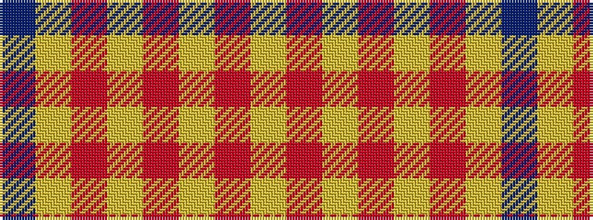

BYRYRYRY

It is a 8 stripe tartan.

<figure class="pat-woven">

<figcaption>idealised sample</figcaption>
</figure>

## Colour Sequence



## Tartans with this colour sequence

| Tartans |
|---------------|
| [Glassary #3](/setts/s8/db4ly1r12ly2r2ly12r1ly4~x4/)|
||
