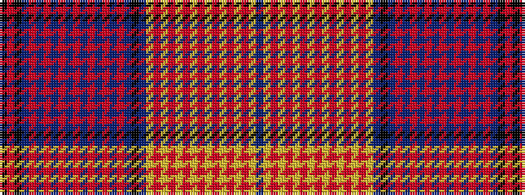

BYRYRYRYRYRYRYRYBKBRBRBRBRBRBRBRBKRK

It is a 36 stripe tartan.

<figure class="pat-woven">

<figcaption>idealised sample</figcaption>
</figure>

## Colour Sequence



## Tartans with this colour sequence

| Tartans |
|---------------|
| [Newfoundland (Commemorative)](/variants/s36/k50r16k8do8r1do1r1do1r1do1r1do1r1do1r1do1r20do40k12do24lo8r1lo1r1lo1r1lo1r1lo1r1lo1r1lo1r28lo6do4/)|
||
