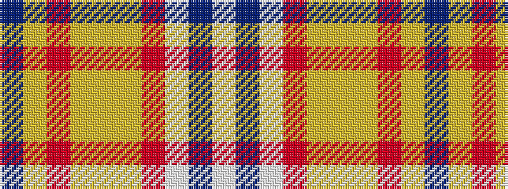

BYRYYYRWBW

It is a 10 stripe tartan.

<figure class="pat-woven">

<figcaption>idealised sample</figcaption>
</figure>

## Colour Sequence



## Tartans with this colour sequence

| Tartans |
|---------------|
| [Confederate Memorial (Military)](/setts/s10/t12lyi4r4lyi4ly2lyi56r18w1db4w3~x2/)|
||
