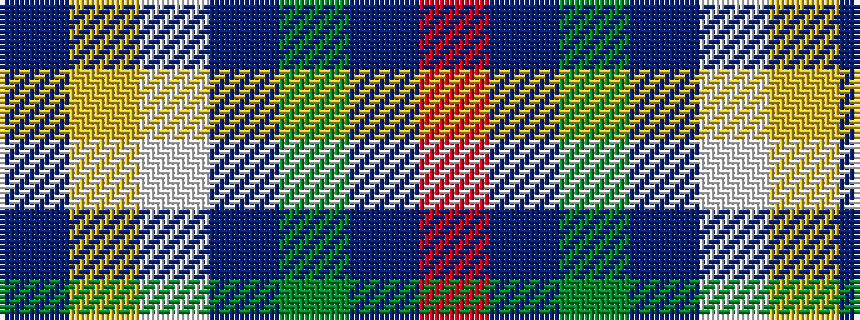

BYWBGBR

It is a 7 stripe tartan.

<figure class="pat-woven">

<figcaption>idealised sample</figcaption>
</figure>

## Colour Sequence



## Tartans with this colour sequence

| Tartans |
|---------------|
| [Kildrummie (Name)](/variants/s7/dt8ly4w2db25dy25dbi2r5~x2/)|
||
