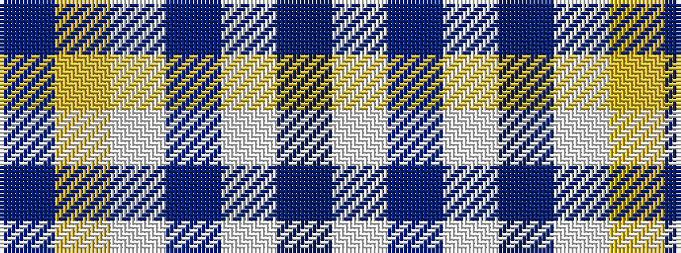

BYWBWBW

It is a 7 stripe tartan.

<figure class="pat-woven">

<figcaption>idealised sample</figcaption>
</figure>

## Colour Sequence



## Tartans with this colour sequence

| Tartans |
|---------------|
| [St. John's (Corporate)](/setts/s7/w2db1w15t12w1ly3db1~x6/)|
||
