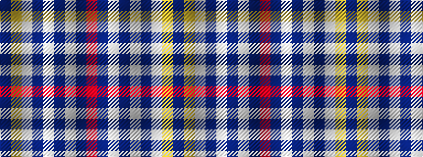

BYWBWBWBR

It is a 9 stripe tartan.

<figure class="pat-woven">

<figcaption>idealised sample</figcaption>
</figure>

## Colour Sequence



## Tartans with this colour sequence

| Tartans |
|---------------|
| [Orlando Dress, City of (District)](/variants/s9/b12ly1w16b1w1b14w3b14r2~x4/)|
||
