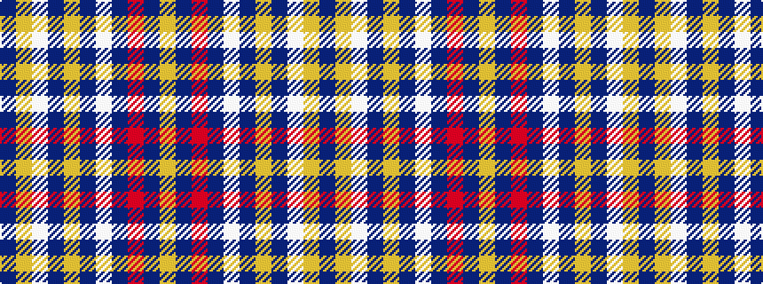

BYWBYBWBRBY

It is a 11 stripe tartan.

<figure class="pat-woven">

<figcaption>idealised sample</figcaption>
</figure>

## Colour Sequence



## Tartans with this colour sequence

| Tartans |
|---------------|
| [Ottawa Fire Service (Corporate)](/variants/s11/db63lo3w3db8lo3db3w3db3r14db9lo3~x2/)|
||
