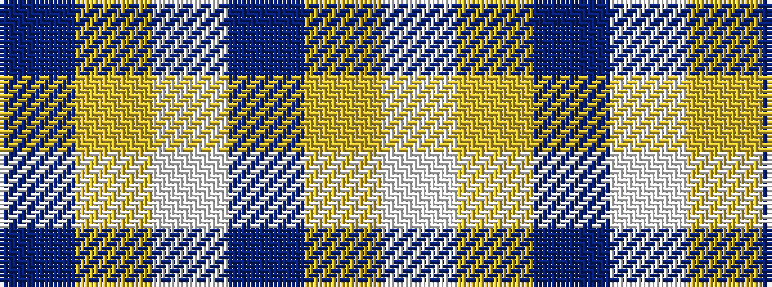

BYWBYW

It is a 6 stripe tartan.

<figure class="pat-woven">

<figcaption>idealised sample</figcaption>
</figure>

## Colour Sequence



## Tartans with this colour sequence

| Tartans |
|---------------|
| [WVU Mountaineer (Corporate)](/setts/s6/dt4ly9w4dt9ly18w1~x2/)|
||
| [WVU Mountaineer Tartan](/setts/s6/db4ly9w4db9ly18w1~x2/)|
||
