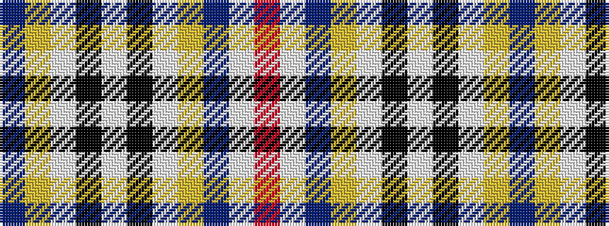

BYWKWKWYBWR

It is a 11 stripe tartan.

<figure class="pat-woven">

<figcaption>idealised sample</figcaption>
</figure>

## Colour Sequence



## Tartans with this colour sequence

| Tartans |
|---------------|
| [Ar Lenn Vor](/setts/s11/b15ly30w30k20w20k15w10ly4b94w4r10/)|
||
| [Ar Lenn Vor](/setts/s11/dt15ly30w30k20w20k15w10ly4dt94w4r10/)|
||
