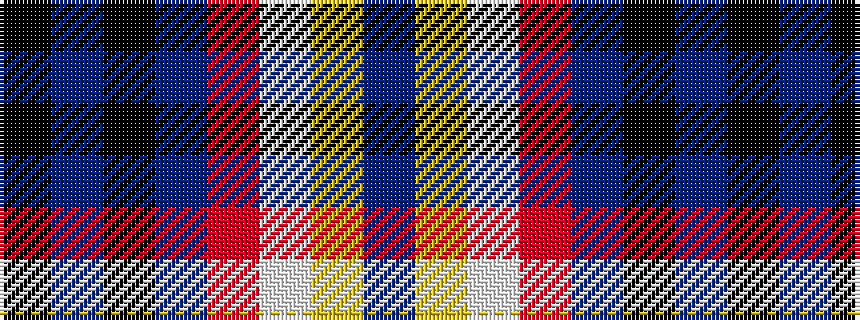

BYWRBKBK

It is a 8 stripe tartan.

<figure class="pat-woven">

<figcaption>idealised sample</figcaption>
</figure>

## Colour Sequence



## Tartans with this colour sequence

| Tartans |
|---------------|
| [McKnight Dress #2 (Personal)](/variants/s8/db4ly1w10r28db25k10t5k3~x4/)|
||
