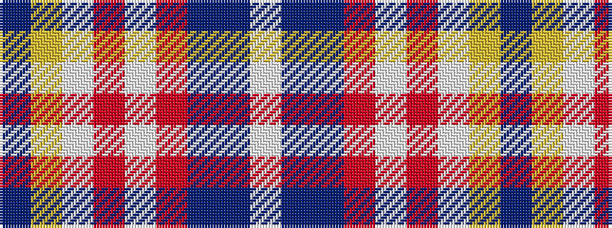

BYWRWRBBW

It is a 9 stripe tartan.

<figure class="pat-woven">

<figcaption>idealised sample</figcaption>
</figure>

## Colour Sequence



## Tartans with this colour sequence

| Tartans |
|---------------|
| [Wcwm 1893-11](/variants/s9/dt1lr7w1o3w1o7dt4p13w1~x4/)|
||
