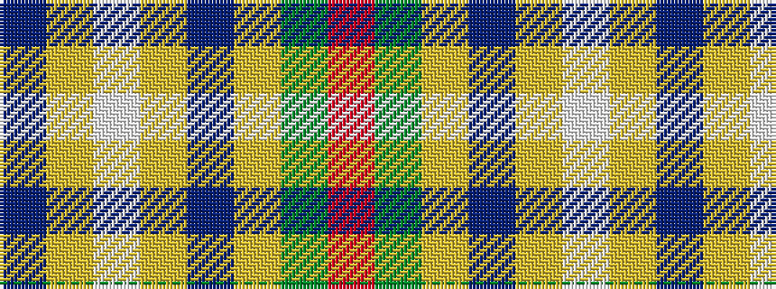

BYWYBYGR

It is a 8 stripe tartan.

<figure class="pat-woven">

<figcaption>idealised sample</figcaption>
</figure>

## Colour Sequence



## Tartans with this colour sequence

| Tartans |
|---------------|
| [Curd (2013)](/setts/s8/r1g1ly1t9ly3w3lr9t1~x4/)|
||
