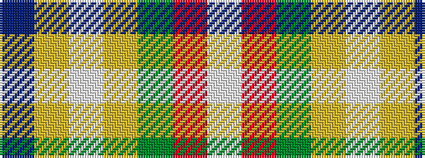

BYWYGRW

It is a 7 stripe tartan.

<figure class="pat-woven">

<figcaption>idealised sample</figcaption>
</figure>

## Colour Sequence



## Tartans with this colour sequence

| Tartans |
|---------------|
| [Kipp](/setts/s7/db1ly7w1lo7g7m7w1~x2/)|
||
