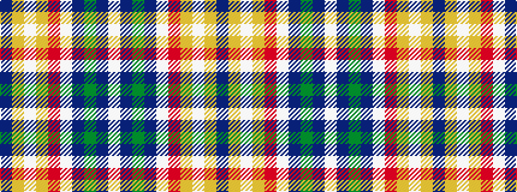

BYWYRWBGBW

It is a 10 stripe tartan.

<figure class="pat-woven">

<figcaption>idealised sample</figcaption>
</figure>

## Colour Sequence



## Tartans with this colour sequence

| Tartans |
|---------------|
| [State Seal of Hawaii (Fashion)](/variants/s10/lb49dt25g16dt4lbi3r8lo4lb18lo1dt9~x2/)|
||
