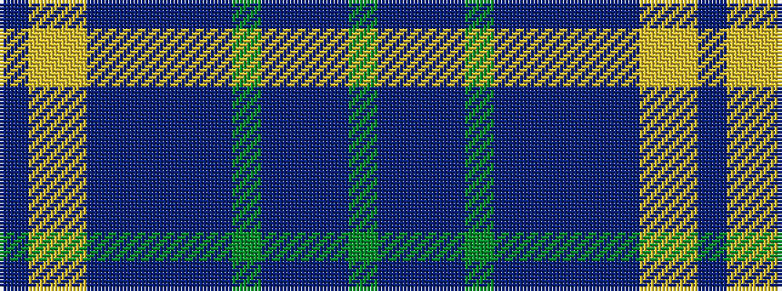

BYYBBBBBGBBBG

It is a 13 stripe tartan.

<figure class="pat-woven">

<figcaption>idealised sample</figcaption>
</figure>

## Colour Sequence



## Tartans with this colour sequence

| Tartans |
|---------------|
| [ENABLE Scotland](/variants/s13/g3n3dp2db14g16dp18n2dp3n14db4ly3lo1n2~x2/)|
||
