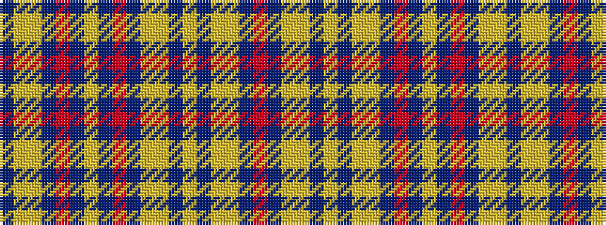

BYYBRBYBRBYYBYBYYBR

It is a 19 stripe tartan.

<figure class="pat-woven">

<figcaption>idealised sample</figcaption>
</figure>

## Colour Sequence



## Tartans with this colour sequence

| Tartans |
|---------------|
| [Longniddry](/variants/s19/r16db4lo2ly2db4lo6db4ly2lo2db16r3db3ly3db3r3db16lo2ly2db3~x2/)|
||
