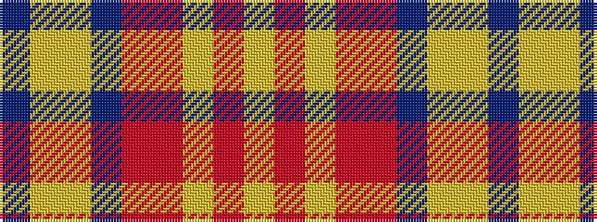

BYYBRRYRY

It is a 9 stripe tartan.

<figure class="pat-woven">

<figcaption>idealised sample</figcaption>
</figure>

## Colour Sequence



## Tartans with this colour sequence

| Tartans |
|---------------|
| [Titanic](/setts/s9/ly2oi1ly1o3oi3db3ly2lr2db1~x4/)|
||
