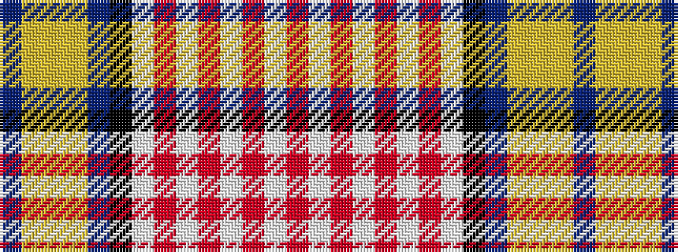

BYYYBKWRWRWRWR

It is a 14 stripe tartan.

<figure class="pat-woven">

<figcaption>idealised sample</figcaption>
</figure>

## Colour Sequence



## Tartans with this colour sequence

| Tartans |
|---------------|
| [Letang Family (Neuilly sur Seine, France) (Personal)](/variants/s14/t14lr2lo2lr2t25k6w17r3w3r3w3r3w3r3~x2/)|
||
