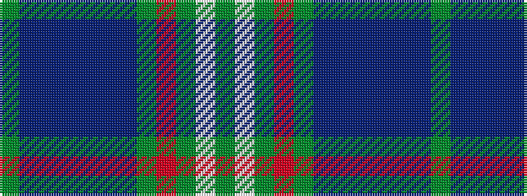

GBBBBBBGRGWG

It is a 12 stripe tartan.

<figure class="pat-woven">

<figcaption>idealised sample</figcaption>
</figure>

## Colour Sequence



## Tartans with this colour sequence

| Tartans |
|---------------|
| [Cailean (Scotch House)](/variants/s12/dy4w2dy2r3dy19t6db3t2db2t2db15dy3~x2/)|
||
