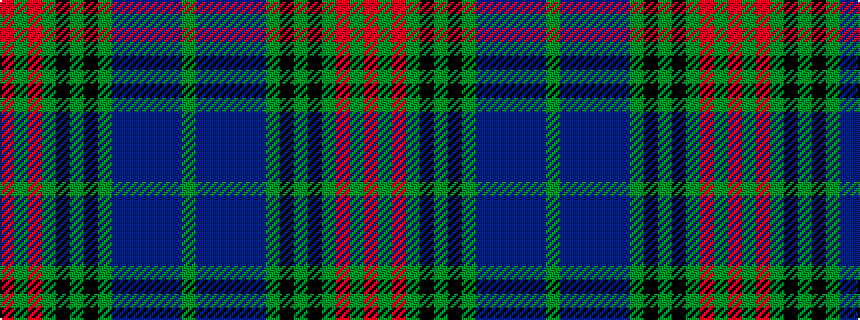

GBBBBBGKGKGRGR

It is a 14 stripe tartan.

<figure class="pat-woven">

<figcaption>idealised sample</figcaption>
</figure>

## Colour Sequence



## Tartans with this colour sequence

| Tartans |
|---------------|
| [Lochcarron Hunting](/variants/s14/dg3db10n3db2n2db2dg3k5dg2k5dg22r2dg3r2~x2/)|
||
