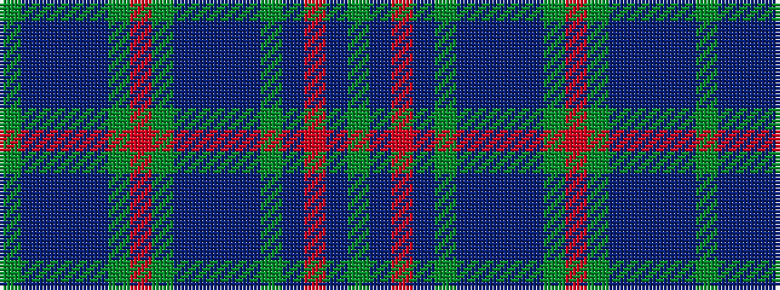

GBBBBGRGBBBBGBRBG

It is a 17 stripe tartan.

<figure class="pat-woven">

<figcaption>idealised sample</figcaption>
</figure>

## Colour Sequence



## Tartans with this colour sequence

| Tartans |
|---------------|
| [Frangord](/setts/s17/dg14dbi2r2dbi2dg22t2dbi16t2db20dg5r2dg5db20t2dbi16t2dg8~x2/)|
||
