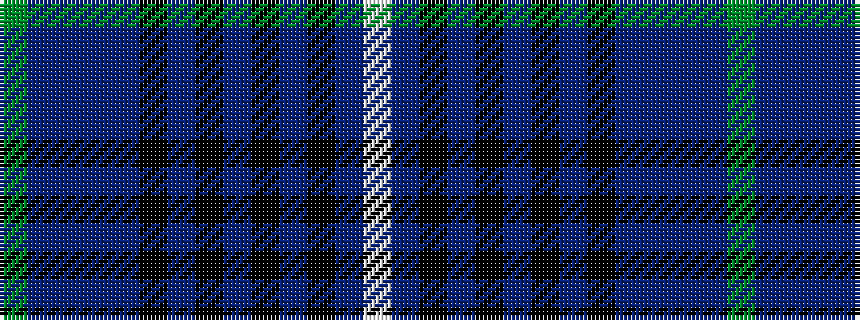

GBBBBKBKBKBKBW

It is a 14 stripe tartan.

<figure class="pat-woven">

<figcaption>idealised sample</figcaption>
</figure>

## Colour Sequence



## Tartans with this colour sequence

| Tartans |
|---------------|
| [Mighty Men](/variants/s14/g40do1dp4do1dp4k4dr1k1dr1k1dr1k1dr2w4~x2/)|
||
