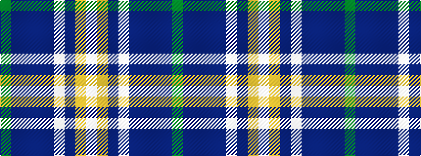

GBBBBWBYW

It is a 9 stripe tartan.

<figure class="pat-woven">

<figcaption>idealised sample</figcaption>
</figure>

## Colour Sequence



## Tartans with this colour sequence

| Tartans |
|---------------|
| [Boucherville Dress](/variants/s9/w20lo2n5w4db2n2db2n2dg1~x2/)|
||
