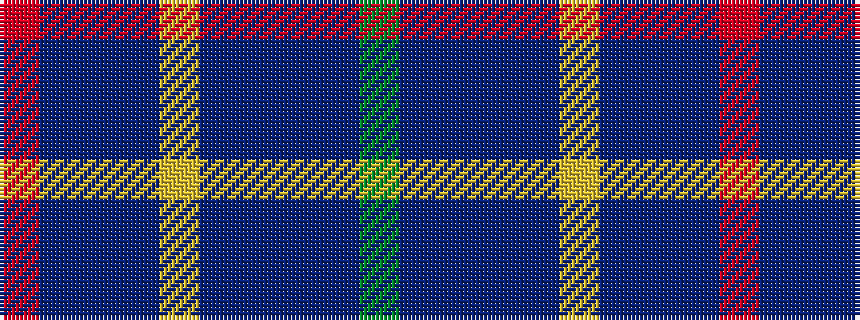

GBBBBYBBBR

It is a 10 stripe tartan.

<figure class="pat-woven">

<figcaption>idealised sample</figcaption>
</figure>

## Colour Sequence



## Tartans with this colour sequence

| Tartans |
|---------------|
| [Timmins (2013)](/setts/s10/r4db2dp14db12ly1t32db12t14db2g4~x2/)|
||
| [Timmins (Personal)](/setts/s10/r4dt2dp14dt12ly1db32dt12db14dt2g4~x2/)|
||
