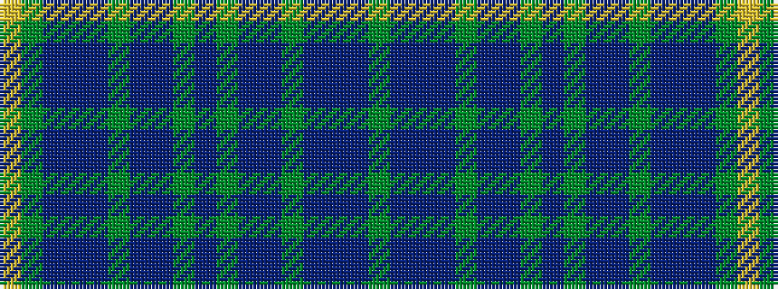

GBBBGBBGBGBBGBBBGY

It is a 18 stripe tartan.

<figure class="pat-woven">

<figcaption>idealised sample</figcaption>
</figure>

## Colour Sequence



## Tartans with this colour sequence

| Tartans |
|---------------|
| [Islay Whisky Club](/setts/s18/dg4t3dp3dr30g4t3dp3g4dr30g4dp3t3g4dr30dp3t3dg4ly2~x2/)|
||
