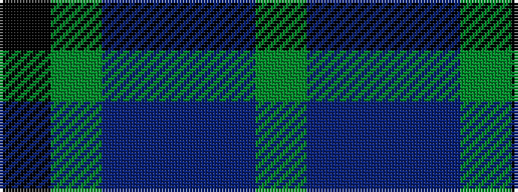

GBBBGK

It is a 6 stripe tartan.

<figure class="pat-woven">

<figcaption>idealised sample</figcaption>
</figure>

## Colour Sequence



## Tartans with this colour sequence

| Tartans |
|---------------|
| [Potts (Personal)](/variants/s6/k1y3db3do28db36y1~x2/)|
||
| [Scott Green (Sir Walter)](/variants/s6/g3t1db7t1g3k1~x8/)|
||
