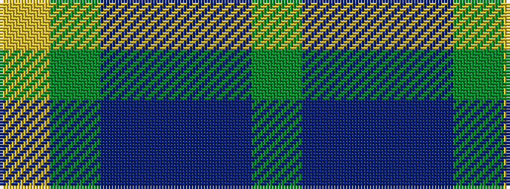

GBBBGY

It is a 6 stripe tartan.

<figure class="pat-woven">

<figcaption>idealised sample</figcaption>
</figure>

## Colour Sequence



## Tartans with this colour sequence

| Tartans |
|---------------|
| [Potts (Personal)](/setts/s6/y1db36do28db3y3ly1~x2/)|
||
| [Scottish Ballet](/setts/s6/ly5g22dp15dp11dp5g2~x2/)|
||
