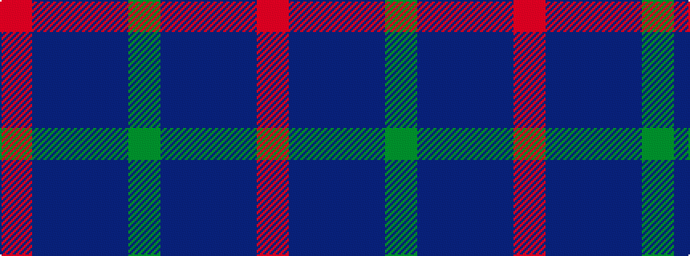

GBBBR

It is a 5 stripe tartan.

<figure class="pat-woven">

<figcaption>idealised sample</figcaption>
</figure>

## Colour Sequence



## Tartans with this colour sequence

| Tartans |
|---------------|
| [Scottish Netball (1987) (Corporate)](/variants/s5/r2dp20db9dp20g2~x2/)|
||
| [Scottish Netball Association](/variants/s5/r2p20db9p20g2~x2/)|
||
