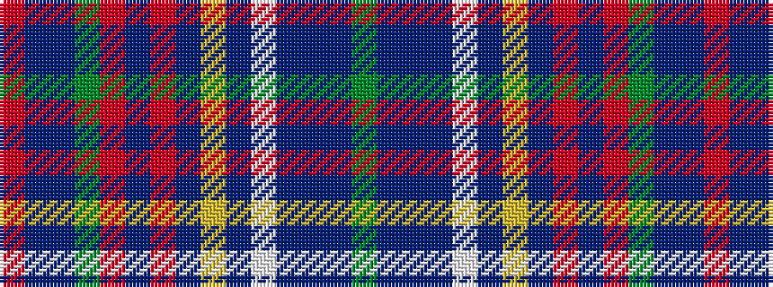

GBBBWBYBRBRGBBR

It is a 15 stripe tartan.

<figure class="pat-woven">

<figcaption>idealised sample</figcaption>
</figure>

## Colour Sequence



## Tartans with this colour sequence

| Tartans |
|---------------|
| [Australian Defence Force Academy, The](/setts/s15/g3db1t34db2w2db2lo2db2r2db8r2g3db1t2r2~x2/)|
||
