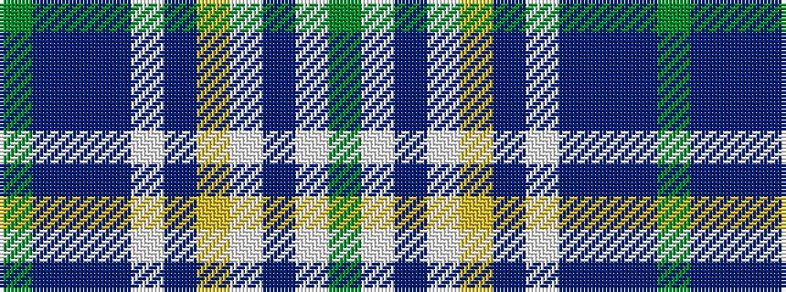

GBBBWBYWBWG

It is a 11 stripe tartan.

<figure class="pat-woven">

<figcaption>idealised sample</figcaption>
</figure>

## Colour Sequence



## Tartans with this colour sequence

| Tartans |
|---------------|
| [Scottish Bear (Mathan Albannach)](/setts/s11/dy11w3dbi5w2ly1dbi4w1dbi2db11dbi3g2~x2/)|
||
