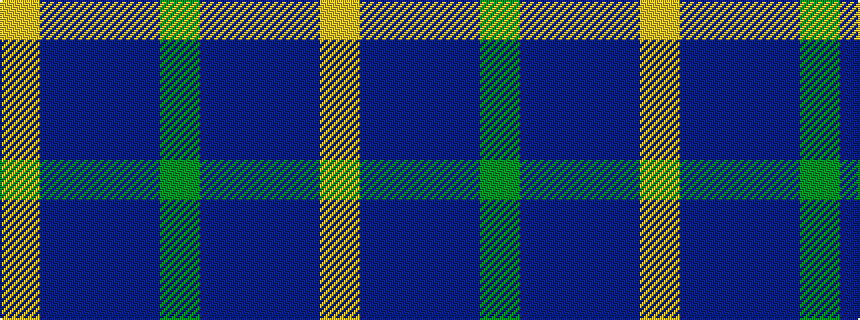

GBBBY

It is a 5 stripe tartan.

<figure class="pat-woven">

<figcaption>idealised sample</figcaption>
</figure>

## Colour Sequence



## Tartans with this colour sequence

| Tartans |
|---------------|
| [Bryson (2000)](/variants/s5/g5dp2db5dp10ly2~x2/)|
||
| [Open Championship (2000)](/variants/s5/dg1db2dbi5db10ly1~x8/)|
||
| [Open Championship, The](/variants/s5/dg1db2dbi5db11ly1~x4/)|
||
| [Pearson](/variants/s5/ly6db28do2db28y1~x2/)|
||
