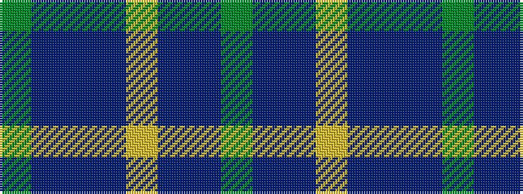

GBBBYBBG

It is a 8 stripe tartan.

<figure class="pat-woven">

<figcaption>idealised sample</figcaption>
</figure>

## Colour Sequence



## Tartans with this colour sequence

| Tartans |
|---------------|
| [Daks (Blue)](/setts/s8/dy3dbi6db2lo2db11dbi2db2dy3~x2/)|
||
| [Daks Muted blue Trade Tartan Tartan Number: 1725. Earliest known date: 1987 Submitted in 1981 as a potential Currie sett. See products available Copyright © Blair Urquhart, Comrie, 2015](/setts/s8/dy5dbi12db4lo4db22dbi3db4dy5/)|
||
