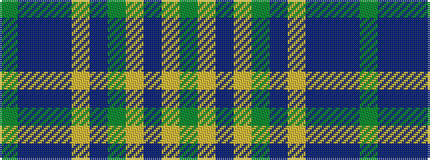

GBBBYBGYBYG

It is a 11 stripe tartan.

<figure class="pat-woven">

<figcaption>idealised sample</figcaption>
</figure>

## Colour Sequence



## Tartans with this colour sequence

| Tartans |
|---------------|
| [Yarrow](/variants/s11/dy42do10t2do2lo2do2dy10lo6do2lo3dy2~x2/)|
||
