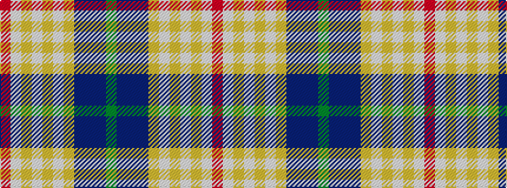

GBBBYWYWYWR

It is a 11 stripe tartan.

<figure class="pat-woven">

<figcaption>idealised sample</figcaption>
</figure>

## Colour Sequence



## Tartans with this colour sequence

| Tartans |
|---------------|
| [Rosslyn Chapel](/variants/s11/g12db1p4db30lo3w2lo3w2lo3w10r4~x2/)|
||
| [Rosslyn Chapel](/variants/s11/g12db1dp4db30lo3w2lo3w2lo3w10r4~x2/)|
||
