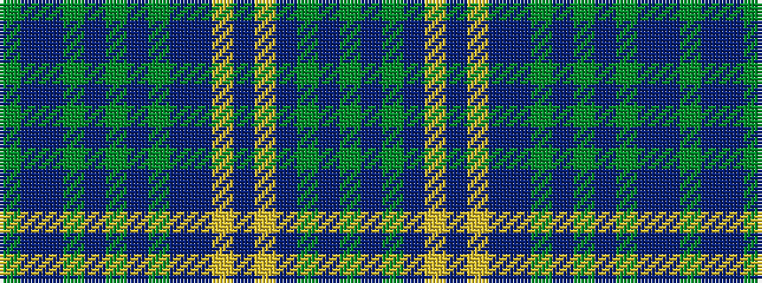

GBBGBGBGBBYBYBGBG

It is a 17 stripe tartan.

<figure class="pat-woven">

<figcaption>idealised sample</figcaption>
</figure>

## Colour Sequence



## Tartans with this colour sequence

| Tartans |
|---------------|
| [Fermanagh](/variants/s17/y3t20db3g3db3g3db3g3db4t13ly2t2ly2t3gi2t3g3~x2/)|
||
| [Fermanagh, County (District)](/variants/s17/dy3dt20db4dg3db3dg3db3dg3db4dt13lo2dt2lo2dt2dg2dt2dg3~x2/)|
||
