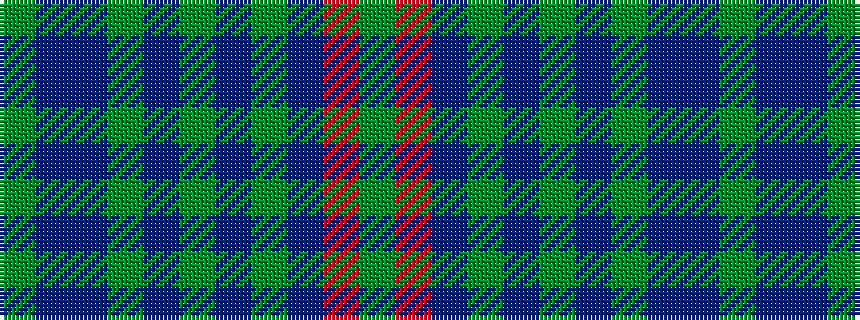

GBBGBGBGBRG

It is a 11 stripe tartan.

<figure class="pat-woven">

<figcaption>idealised sample</figcaption>
</figure>

## Colour Sequence



## Tartans with this colour sequence

| Tartans |
|---------------|
| [Pride of Scotland Autumn](/variants/s11/g9db2dp2g2dp18g2db2g1db19r33g2~x2/)|
||
