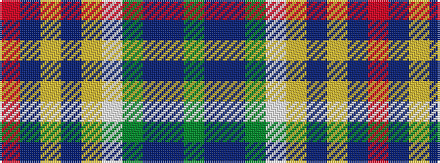

GBBGWYBYBR

It is a 10 stripe tartan.

<figure class="pat-woven">

<figcaption>idealised sample</figcaption>
</figure>

## Colour Sequence



## Tartans with this colour sequence

| Tartans |
|---------------|
| [Northern College](/variants/s10/g10db6t6g10w8ly3t2ly3db2r2/)|
||
| [Northern College (Ontario)](/variants/s10/g5db3t3g5w4ly2t1ly2db1r1~x6/)|
||
