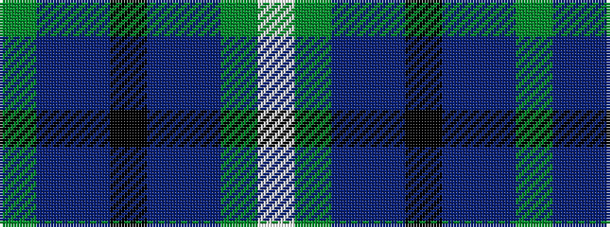

GBBKBBGW

It is a 8 stripe tartan.

<figure class="pat-woven">

<figcaption>idealised sample</figcaption>
</figure>

## Colour Sequence



## Tartans with this colour sequence

| Tartans |
|---------------|
| [Wilson's No.229](/variants/s8/dg14dp11t3k5t3dp11dg14w2~x2/)|
||
