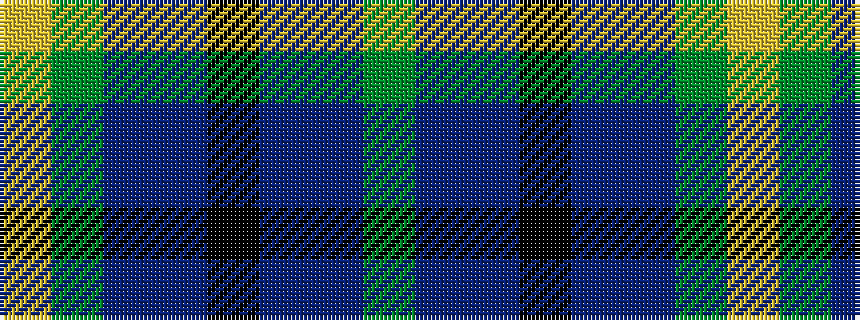

GBBKBBGY

It is a 8 stripe tartan.

<figure class="pat-woven">

<figcaption>idealised sample</figcaption>
</figure>

## Colour Sequence



## Tartans with this colour sequence

| Tartans |
|---------------|
| [Wellington (Wilson 122)](/variants/s8/g14dp11t3k2t3dp11g14ly1~x2/)|
||
