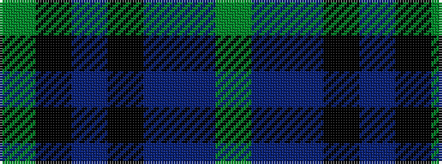

GBBKBKG

It is a 7 stripe tartan.

<figure class="pat-woven">

<figcaption>idealised sample</figcaption>
</figure>

## Colour Sequence



## Tartans with this colour sequence

| Tartans |
|---------------|
| [Blaylock Annandale (Name)](/variants/s7/g24db6t3k6db12k15g4~x2/)|
||
