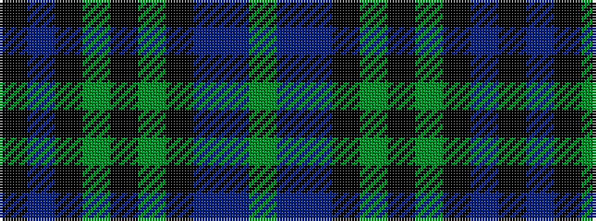

GBBKGKGKBK

It is a 10 stripe tartan.

<figure class="pat-woven">

<figcaption>idealised sample</figcaption>
</figure>

## Colour Sequence



## Tartans with this colour sequence

| Tartans |
|---------------|
| [Rikaco Heirloom](/setts/s10/k3n3k1dg26k10yi1k3dp5n4y2~x2/)|
||
