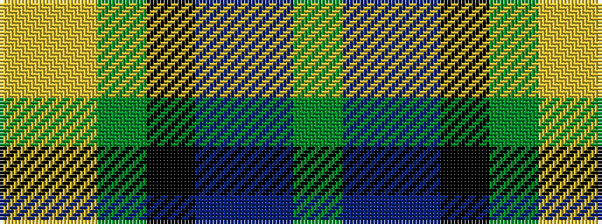

GBBKGYY

It is a 7 stripe tartan.

<figure class="pat-woven">

<figcaption>idealised sample</figcaption>
</figure>

## Colour Sequence



## Tartans with this colour sequence

| Tartans |
|---------------|
| [Camelot (Corporate)](/setts/s7/g30p5db32k32g36lg2ly5/)|
||
