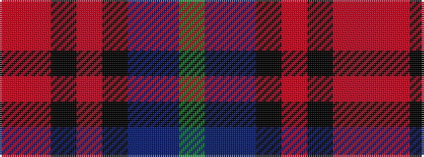

GBBKRKRR

It is a 8 stripe tartan.

<figure class="pat-woven">

<figcaption>idealised sample</figcaption>
</figure>

## Colour Sequence



## Tartans with this colour sequence

| Tartans |
|---------------|
| [Anne Arundel County](/setts/s8/r4o10k9o2k9db33dt7g4~x2/)|
||
