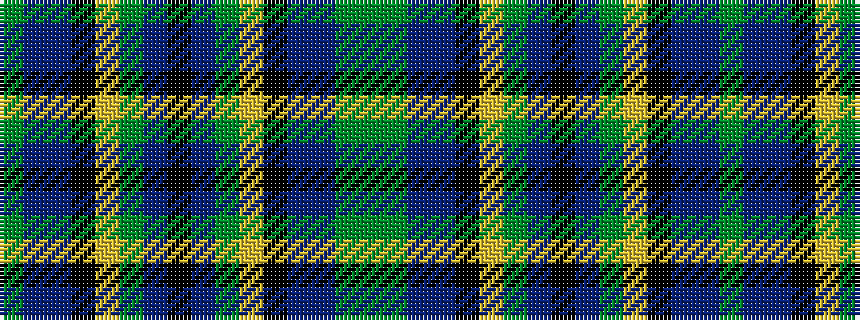

GBBKYGBKBGYKBBGG

It is a 16 stripe tartan.

<figure class="pat-woven">

<figcaption>idealised sample</figcaption>
</figure>

## Colour Sequence



## Tartans with this colour sequence

| Tartans |
|---------------|
| [Wilson's No.225](/variants/s16/g16y2dp13t2k6ly2g16t2k12~x2/)|
||
