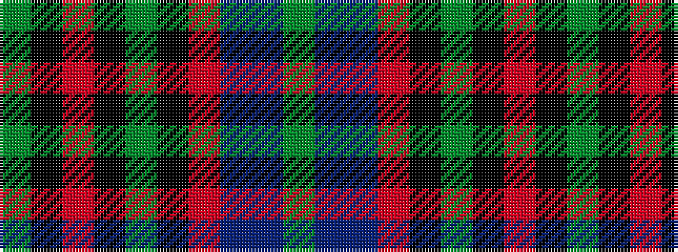

GBBRKGKRKG

It is a 10 stripe tartan.

<figure class="pat-woven">

<figcaption>idealised sample</figcaption>
</figure>

## Colour Sequence



## Tartans with this colour sequence

| Tartans |
|---------------|
| [Lochaber](/setts/s10/g4t2db33r2k35g33k1r2k1g4~x2/)|
||
| [Lochaber - 1819 (District)](/setts/s10/g2t2db33r2k35g33k1r2k1g2~x2/)|
||
