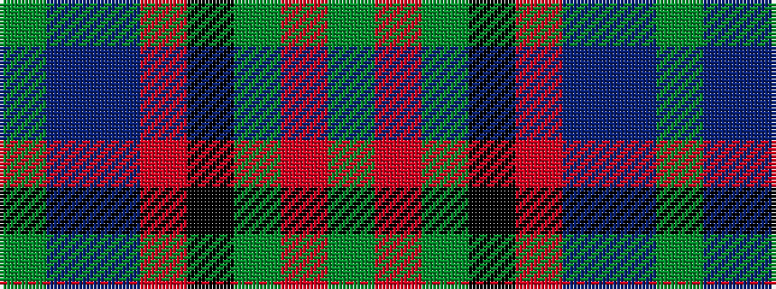

GBBRKGRG

It is a 8 stripe tartan.

<figure class="pat-woven">

<figcaption>idealised sample</figcaption>
</figure>

## Colour Sequence



## Tartans with this colour sequence

| Tartans |
|---------------|
| [Lochaber](/variants/s8/g3r1g18k20r1db18t1g2~x4/)|
||
| [Lochaber #2](/variants/s8/dg3r1dg18k20r1db18t1dg2~x4/)|
||
