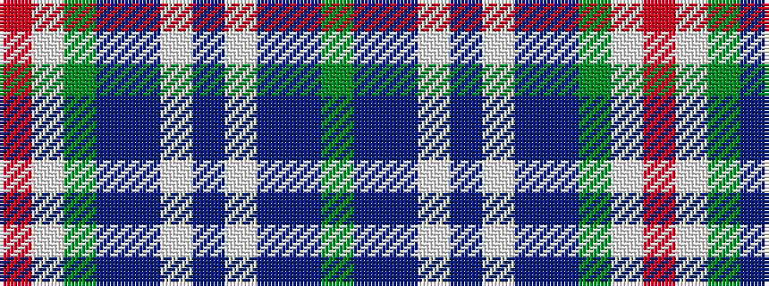

GBBWBWBBGWR

It is a 11 stripe tartan.

<figure class="pat-woven">

<figcaption>idealised sample</figcaption>
</figure>

## Colour Sequence



## Tartans with this colour sequence

| Tartans |
|---------------|
| [Kuehle Family (Personal)](/setts/s11/y30db6p1w2p6w2p1db6y30lb1r3~x2/)|
||
