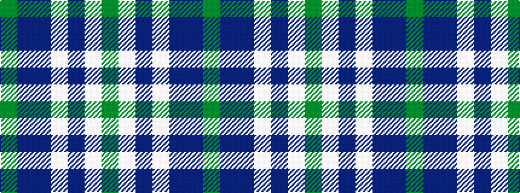

GBBWBWG

It is a 7 stripe tartan.

<figure class="pat-woven">

<figcaption>idealised sample</figcaption>
</figure>

## Colour Sequence



## Tartans with this colour sequence

| Tartans |
|---------------|
| [Earl of St. Andrews (Fashion)](/setts/s7/g5b14bi10w2bi1w1g4~x4/)|
||
| [Highlands Country Club](/setts/s7/g5db15t11w2t1w1dg4~x4/)|
||
