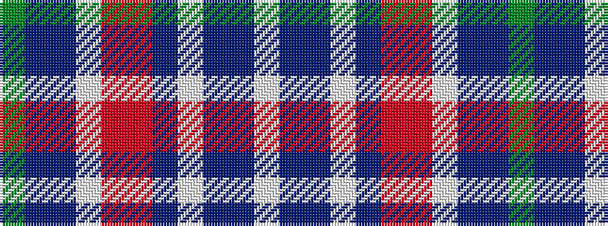

GBBWRRBWBBW

It is a 11 stripe tartan.

<figure class="pat-woven">

<figcaption>idealised sample</figcaption>
</figure>

## Colour Sequence



## Tartans with this colour sequence

| Tartans |
|---------------|
| [Cian Clan Irish Family Tartan Tartan Number: 43. Earliest known date: 2003 STS previously labelled 'unidentified'. Actual count reduced 50% prop. See products available Copyright © Blair Urquhart, Comrie, 2015](/setts/s11/lb38db2t2lb19db8r18m8lb18t18db2dy4/)|
||
