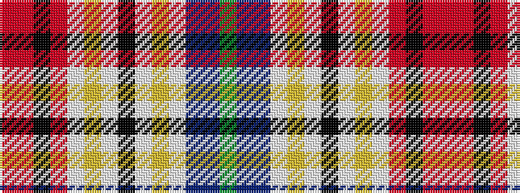

GBBWYWKWYWRKRR

It is a 14 stripe tartan.

<figure class="pat-woven">

<figcaption>idealised sample</figcaption>
</figure>

## Colour Sequence



## Tartans with this colour sequence

| Tartans |
|---------------|
| [Dundee Dress](/setts/s14/r36ri2k16ri2w19ly4w2k2w2ly4w12t2db10g10~x2/)|
||
| [Dundee Dress District Tartan Tartan Number: 691. Earliest known date: 1986 Original index card confused. See products available Copyright © Blair Urquhart, Comrie, 2015](/setts/s14/r36m2k16m2w19ly4w2k2w2ly4w12t2db10g10~x2/)|
||
